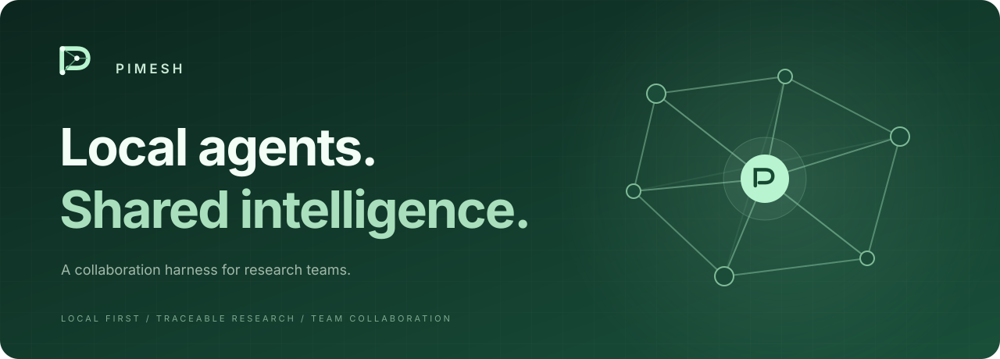
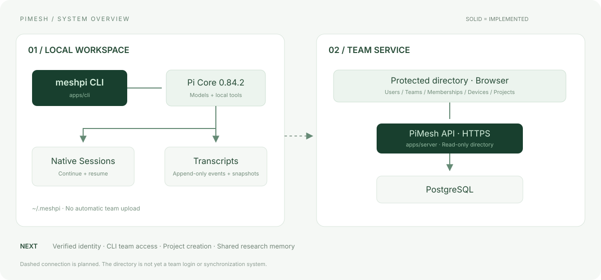
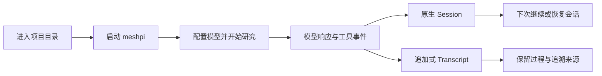

<p align="center">
  
</p>

<p align="center">
  <strong>让每个人的研究过程，成为团队可以追溯的知识。</strong>
</p>

<p align="center">
  <a href="https://github.com/jerrymomo10/PiMesh/actions/workflows/test.yml"></a>
  
  =22.19">
  
</p>

<p align="center">
  <a href="#为什么是-pimesh">为什么 PiMesh</a> ·
  <a href="#架构">架构</a> ·
  <a href="#快速开始">快速开始</a> ·
  <a href="#路线图">路线图</a> ·
  <a href="docs/team-service.md">部署文档</a>
</p>

---

## 为什么是 PiMesh

多位研究员，在多个端并行探索。PiMesh 希望让每个人的研究过程自然沉淀，
逐步连接团队的成员、项目与知识，让协作融入 Agent 工作的自然流动之中。

<table>
<tr>
<td width="33%" valign="top">
<strong>01 · 本地开展研究</strong><br><br>
通过 <code>meshpi</code> 使用 Pi 的模型与工具能力。按工作目录隔离会话，在自己的开发环境中继续工作。
</td>
<td width="33%" valign="top">
<strong>02 · 保留完整过程</strong><br><br>
保存原生 Session 与追加式 Transcript。上下文压缩不会替代已保存的历史，失败与中断也有迹可循。
</td>
<td width="33%" valign="top">
<strong>03 · 逐步连接团队</strong><br><br>
已提供受保护的团队目录查看页。成员认证、项目协作与共享 Memory 是接下来要建设的能力。
</td>
</tr>
</table>

> **当前阶段：早期开发。** 本地客户端和团队目录只读服务已实现；服务端 0.2.0 新增邀请码注册与账号登录，需迁移及配置后启用。团队加入、项目创建与跨端同步尚未实现。当前不会自动上传 Transcript。

## 架构



两个应用独立运行、独立锁定依赖：本地 CLI 保存研究过程，服务端提供目录查询。
实线表示已实现的路径，虚线表示规划中的连接。完整边界见 [设计决策](docs/decisions.md)。

## 快速开始

需要 **Git、Node.js ≥22.19.0 和 npm**。当前 CI 覆盖 macOS / Linux，Windows 原生环境尚未验证；
Windows 用户可先在 WSL 中尝试以下 POSIX shell 命令。首次安装需要联网。

```sh
git clone https://github.com/jerrymomo10/PiMesh.git
cd PiMesh
npm ci --prefix apps/cli --ignore-scripts
npm install --global --install-links --ignore-scripts ./apps/cli
meshpi setup
meshpi doctor
```

在研究项目目录运行 `meshpi`，使用 `/login` 配置模型供应商，再用 `/model` 选择模型。
这里的 `/login` 是模型认证，不是团队登录。模型请求使用所选供应商的认证与计费。

```sh
cd /path/to/research-project
meshpi                           # 开始研究
meshpi --continue                # 继续当前目录最近的会话
meshpi --resume                  # 选择历史会话
meshpi paths                     # 查看本地保存位置
```

默认保存到 `~/.meshpi/`，支持绝对路径 `MESHPI_HOME` 覆盖。安装包尚未发布到 npm registry。
用户目录安装、升级旧数据目录及更多参数见 [完整使用指南](docs/getting-started.md)。

## 一次研究如何留下记录



原生 Session 支持继续工作；Transcript 保存 Pi 已交付的消息、事件、流式增量和快照。
不声称能恢复工具内部已截断的输出或模型尚未返回的内容。
记录默认仅本地保存，可能含代码及敏感输入，不应提交到公开仓库。详见 [Transcript 契约](docs/transcripts.md)。

## 团队目录

团队服务提供一个 **HTTPS + 独立查看账号保护的只读页面**：

| 数据视图 | 可查看内容 |
| --- | --- |
| 用户与团队 | 用户身份字段、团队名称与创建者 |
| 成员关系 | 用户所属团队、角色和状态 |
| 设备与项目 | 客户端实例、项目归属及负责人 |

支持计数、搜索、分页和手动刷新，直接读取 PostgreSQL。空库显示空状态，不预置示例成员。
临时查看账号不是团队身份体系。账号与管理员邀请码入口见 [注册登录指南](docs/auth.md)，团队/项目写入 API 尚未实现。按 [服务部署指南](docs/team-service.md) 配置独立实例。

## 路线图

| 阶段 | 内容 | 状态 |
| --- | --- | --- |
| 本地研究基础 | CLI、Session 续接、Transcript 持久化、离线测试与安装验证 | 已实现 |
| 团队目录基础 | PostgreSQL、受保护的只读页面、搜索与分页 | 已实现 |
| 平台身份 | 邀请码注册、用户名/邮箱密码登录、自身账号与退出 | 服务端 0.2.0，需显式启用 |
| 团队身份 | 团队邀请、设备注册、成员关系与权限、CLI 接入 | 待实现 |
| 项目协作 | 项目创建、本地目录绑定、研究记录归属 | 待实现 |
| 共享知识 | 实验记录、Memory 检索、工具沉淀与周报 | 设计中 |

Memory 分层、Transcript 可见性与同步策略尚未定案。路线图是方向说明，不是已经交付的功能承诺。

## 开发与贡献

```text
PiMesh/
├── apps/
│   ├── cli/       本地客户端 · Pi 扩展 · 会话持久化
│   └── server/    团队 API · 目录页面 · 数据库迁移 · 部署
├── docs/          使用指南 · 设计边界 · 工程交接
└── .github/       自动验证
```

```sh
npm ci --ignore-scripts
npm run deps
npm run check
npm test
```

`npm test` 包含客户端、服务端与临时前缀安装测试；模型测试完全离线，安装测试可能访问 npm registry。
真实 PostgreSQL 测试需要单独的临时测试库，默认跳过。更多说明见 [客户端](apps/cli/README.md) 与 [服务端](apps/server/README.md)。

欢迎通过 [Issues](https://github.com/jerrymomo10/PiMesh/issues) 讨论问题和方案，通过功能分支与 PR 提交改动。
协作前请阅读 [AGENTS.md](AGENTS.md) 和 [多机交接流程](docs/collaboration.md)。

## 文档导航

| 入门与运行 | 设计与协作 |
| --- | --- |
| [客户端安装与使用](docs/getting-started.md) | [产品边界与设计决策](docs/decisions.md) |
| [团队服务部署](docs/team-service.md) | [多机协作与交接](docs/collaboration.md) |
| [Transcript 契约](docs/transcripts.md) | [开发任务索引](docs/tasks/README.md) |

## 致谢与许可

基于 [Pi](https://github.com/earendil-works/pi) 构建本地 Agent 运行时，参考
[Research Pi](https://github.com/RosMarinas/Research-Pi) 的研究状态与实验记忆方向；未复制其源码。

**项目源码公开，原创代码的开源许可证尚未选定。** 应用包标记为 `UNLICENSED`，未发布至 npm registry；依赖保留各自许可证。

<p align="center">
  <br>
  <sub>Local agents. Shared intelligence.</sub>
</p>
